# HarvestERP — Application Screenshots

All screenshots captured from the running application at `localhost:3001`.
Date: 2026-03-18

---

## Main Navigation

### 01 — Dashboard
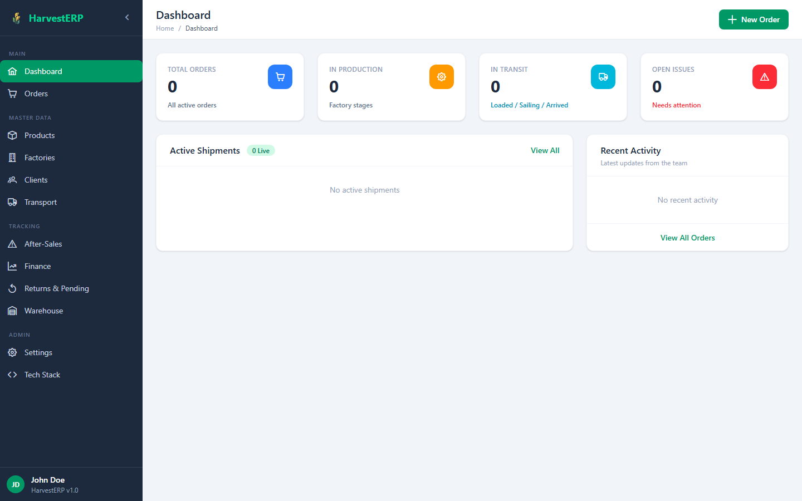

**Purpose:** Main landing page showing key business metrics at a glance.
- **Total Orders** — Count of all active orders
- **In Production** — Orders currently in factory stages
- **In Transit** — Orders that are loaded, sailing, or arrived
- **Open Issues** — Orders needing attention
- **Active Shipments** — Live shipment tracking table
- **Recent Activity** — Timeline of latest team actions

**Route:** `/`

---

### 02 — Orders List
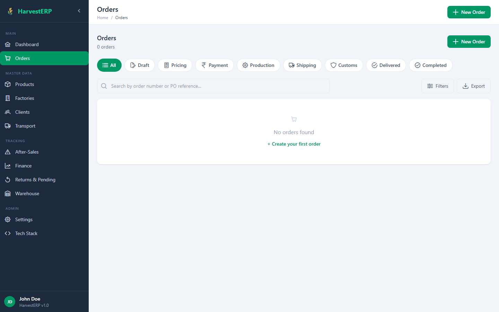

**Purpose:** Complete order management table with filtering and search.
- View all orders with status, client, factory, dates, and amounts
- Filter by order stage (17 stages from DRAFT to COMPLETED)
- Search by order number, client, or factory name
- Click any order to view full detail with tabbed interface
- "+ New Order" button to create a new draft order

**Route:** `/orders`

---

## Master Data

### 03 — Product Catalog
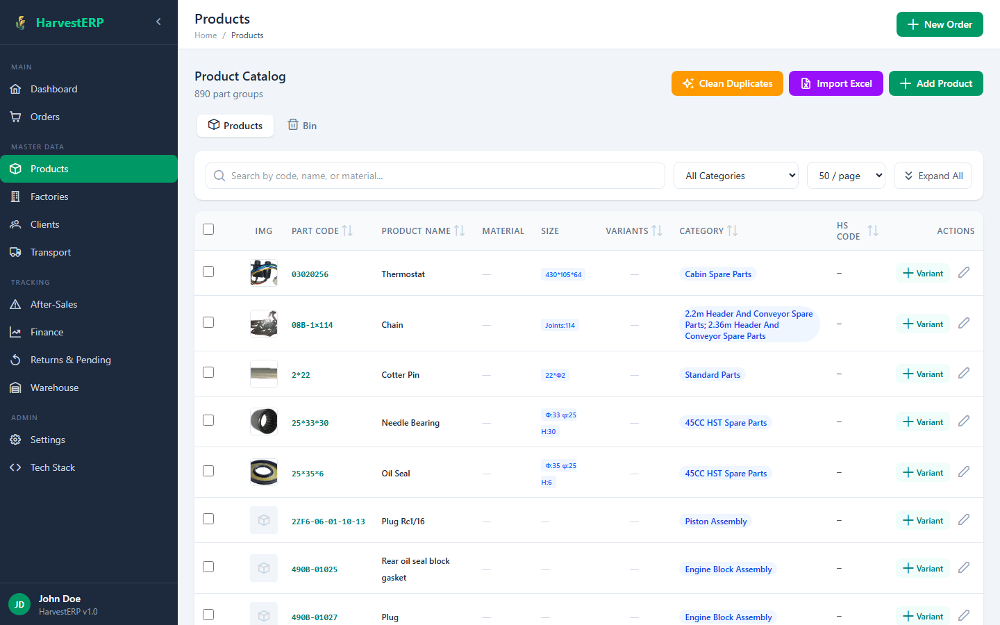

**Purpose:** Browse and manage the complete parts/product inventory.
- **Part Groups** — Products grouped by product code (parent/variant hierarchy)
- **Product Images** — Thumbnails extracted from Excel uploads
- **Variant System** — Each part code can have multiple variants (different dimensions, materials)
- **Soft Delete** — "Bin" tab shows deleted products that can be restored
- **Search & Filter** — Find products by name, code, or category

**Route:** `/products`

---

### 04 — Excel Import
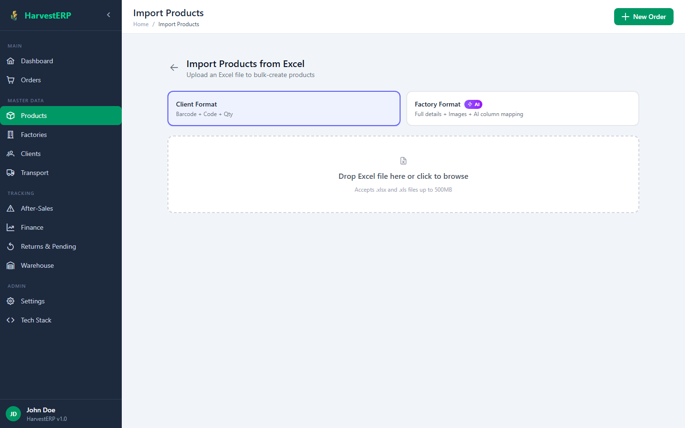

**Purpose:** Bulk import products from Excel files with intelligent conflict resolution.
- **Upload** — Drag & drop or browse for .xlsx files
- **AI Column Mapping** — Automatically detects which Excel columns map to which fields
- **Image Extraction** — Pulls embedded images from Excel (Place-in-Cell / richData format)
- **Conflict Resolution Panel** — When duplicate part codes are found:
  - Smart AI analysis suggests "Add as variant" vs "Duplicate (skip)"
  - Bulk select and apply actions to all conflicts at once
  - Sort conflicts by part code or row count
- **Two-Step Flow** — "Process" updates preview, "Create Products" commits to DB
- **Chinese Name Support** — Extracts and stores Chinese product names

**Route:** `/products/upload-excel`

---

### 05 — Factories
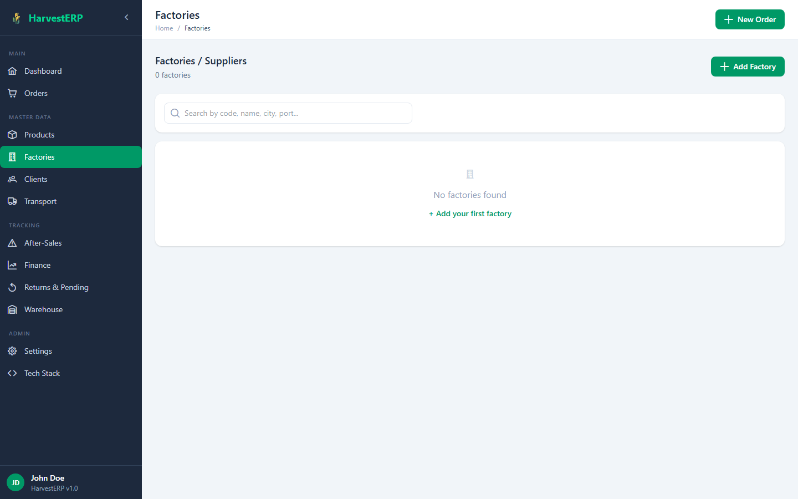

**Purpose:** Manage supplier/factory master data.
- Factory name, location, contact information
- Link factories to products they supply
- Track factory payment terms and history
- Factory contacts with roles and phone numbers

**Route:** `/factories`

---

### 06 — Clients
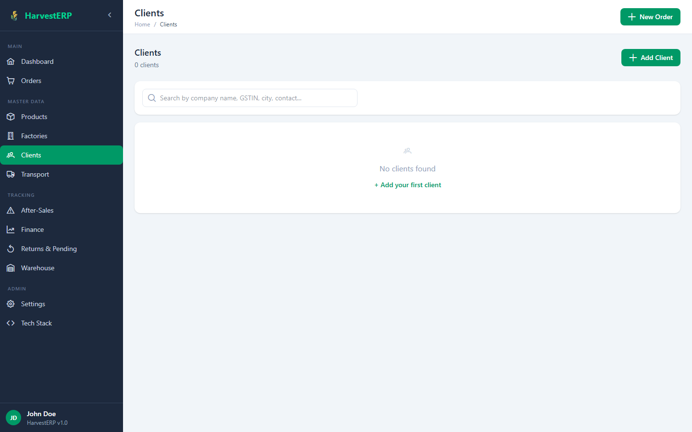

**Purpose:** Manage customer/client master data.
- Client company name, country, contact details
- Client-specific pricing and credit terms
- Order history per client
- Client product barcodes mapping

**Route:** `/clients`

---

### 07 — Transport & Shipping
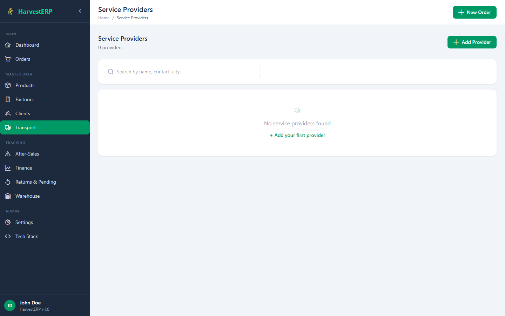

**Purpose:** Manage shipping logistics and service providers.
- Service provider management (shipping lines, freight forwarders)
- Shipment tracking with container numbers
- Transit time estimates by route
- Shipping document management

**Route:** `/transport`

---

## Tracking

### 08 — After-Sales
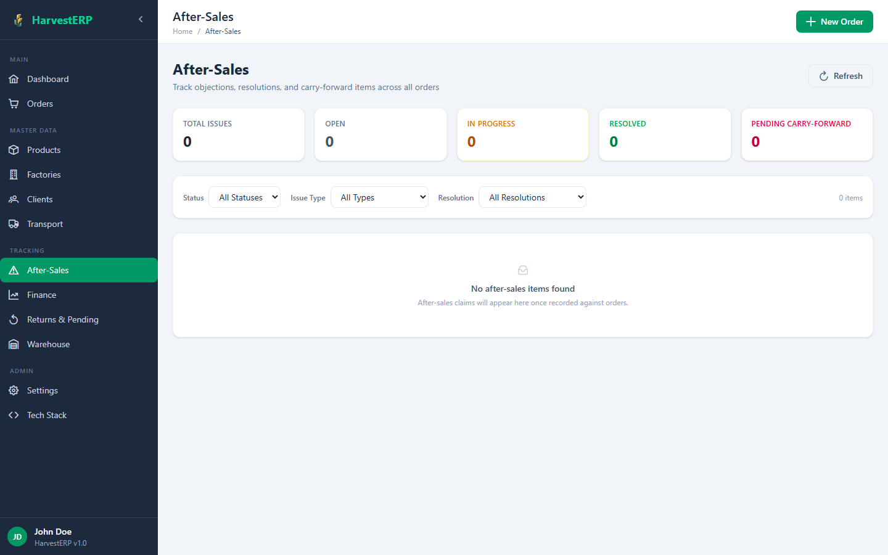

**Purpose:** Track post-delivery issues, returns, and warranty claims.
- Log after-sales items with descriptions and images
- Link issues to specific orders and products
- Track resolution status and timeline
- Photo evidence of damaged/defective items

**Route:** `/after-sales`

---

### 09 — Finance
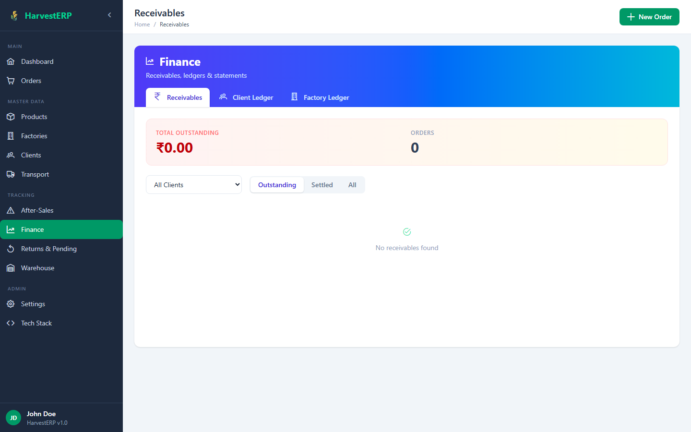

**Purpose:** Financial overview and payment tracking.
- **Receivables** — Track payments from clients (advances, balances)
- **Payables** — Track payments to factories
- **Proforma Invoices** — Generate and manage PIs with revision history
- **Exchange Rates** — USD/INR rate management
- **Bills of Entry** — Customs duty calculations with HSN tariff lookup
- **Payment Audit Log** — Complete payment history with timestamps

**Route:** `/finance`

---

### 10 — Returns & Pending
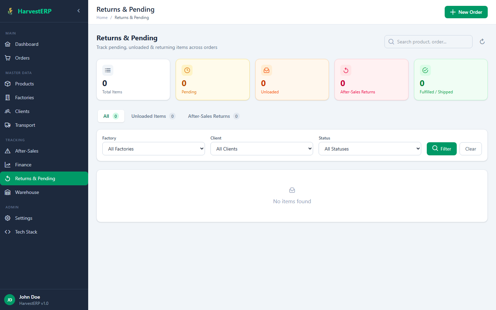

**Purpose:** Track items pending return or resolution.
- Items that failed verification during delivery
- Quantity mismatches between ordered and received
- Damage reports with photo evidence
- Resolution workflow (return, replace, credit)

**Route:** `/returns-pending`

---

### 11 — Warehouse Stock
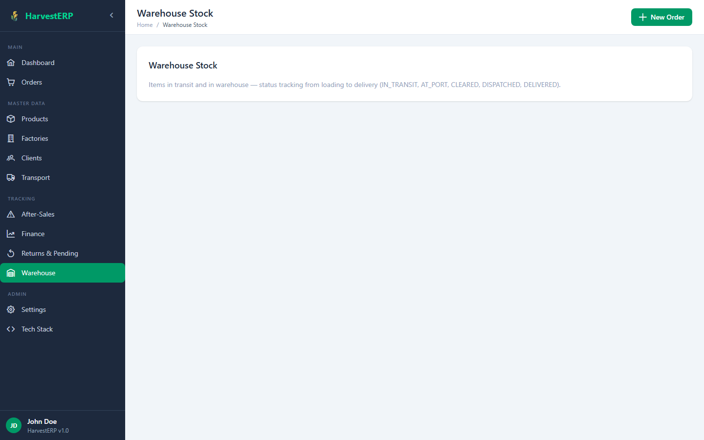

**Purpose:** Current warehouse inventory levels.
- Stock quantities by product
- Unloaded items tracking
- Stock movements history
- Low stock alerts

**Route:** `/warehouse`

---

## Admin

### 12 — Settings
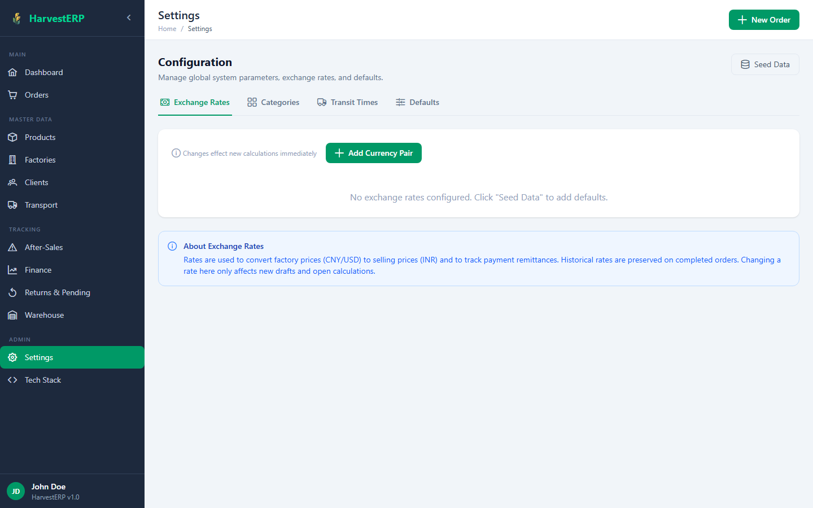

**Purpose:** System configuration and default values.
- **Default Markup Rates** — Set default profit margins for PI generation
- **Freight & Insurance Rates** — Default shipping cost percentages
- **Exchange Rates** — Configure USD/INR conversion rates
- **Company Information** — Business name, address, logos
- **System Preferences** — Date formats, currency display, etc.

**Route:** `/settings`

---

## Tech Stack (Interactive)

### 13 — Tech Stack Overview
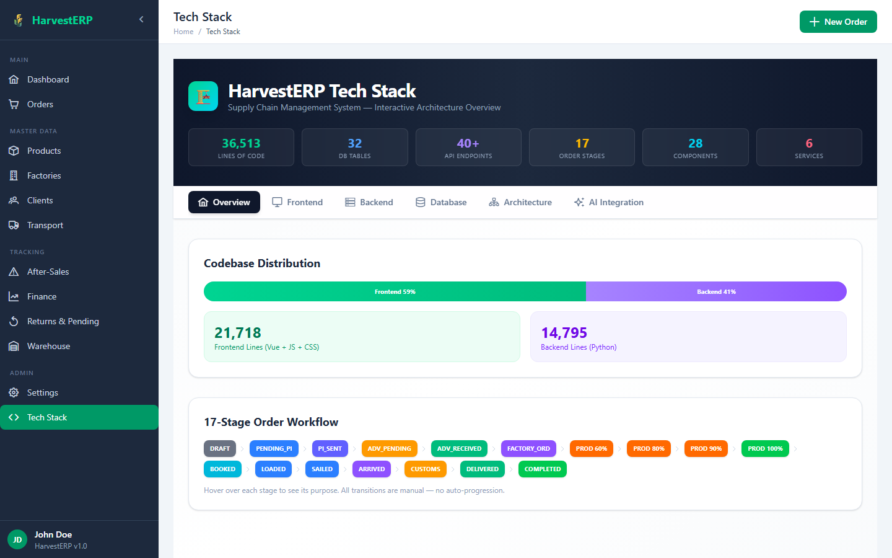

**Purpose:** Interactive architecture documentation showing the full technology stack.
- **Stats Bar** — Lines of code, DB tables, API endpoints, order stages, components, services
- **Code Distribution** — Frontend vs Backend split with visual bar
- **17-Stage Order Workflow** — Visual pipeline of all order stages with color coding

**Route:** `/tech-stack` (Overview tab)

---

### 14 — Frontend Stack
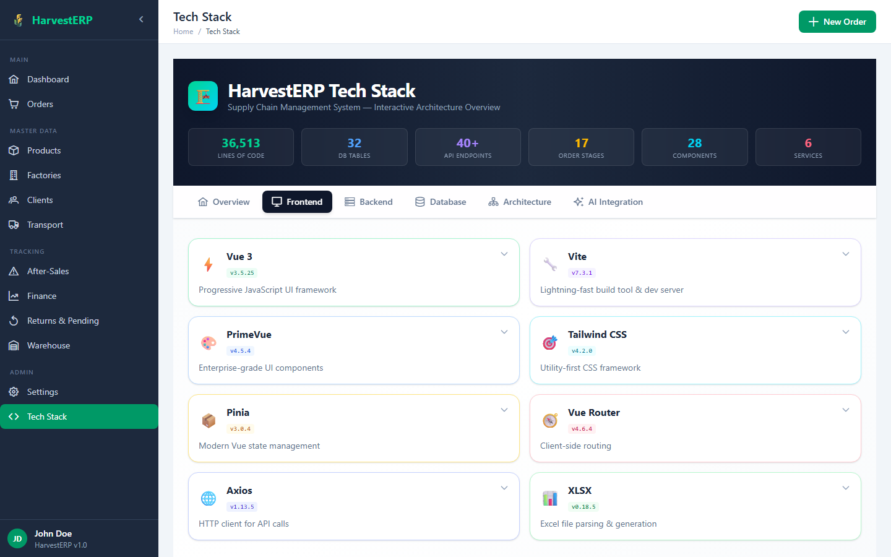

**Purpose:** All frontend technologies with versions and purposes.
- Vue 3, Vite, PrimeVue, Tailwind CSS, Pinia, Vue Router, Axios, XLSX
- Click any card to expand and see file locations and detailed descriptions

**Route:** `/tech-stack` (Frontend tab)

---

### 15 — Backend Stack
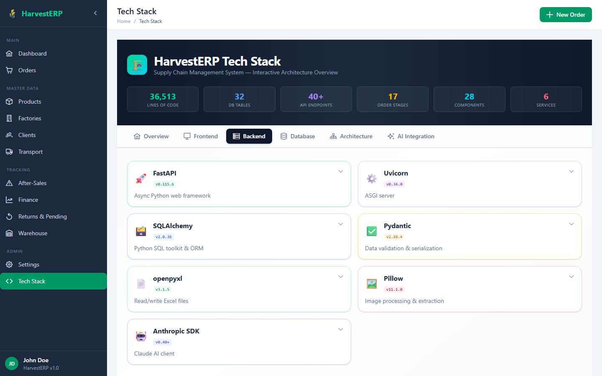

**Purpose:** All backend technologies with versions and purposes.
- FastAPI, Uvicorn, SQLAlchemy, Pydantic, openpyxl, Pillow, Anthropic SDK
- Click any card to expand and see file locations and detailed descriptions

**Route:** `/tech-stack` (Backend tab)

---

### 16 — Database Schema
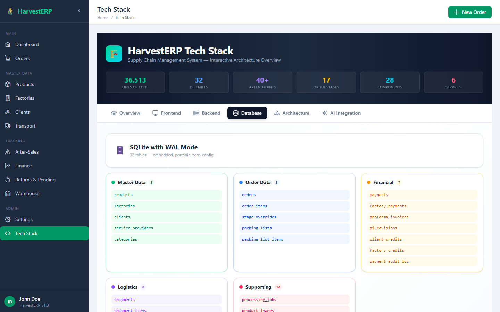

**Purpose:** Visual overview of all 32 database tables grouped by domain.
- **Master Data** — products, factories, clients, service_providers, categories
- **Order Data** — orders, order_items, stage_overrides, packing_lists
- **Financial** — payments, invoices, credits, audit logs
- **Logistics** — shipments, customs, delivery records, warehouse
- **Supporting** — processing_jobs, images, barcodes, exchange_rates

**Route:** `/tech-stack` (Database tab)

---

### 17 — Architecture Layers
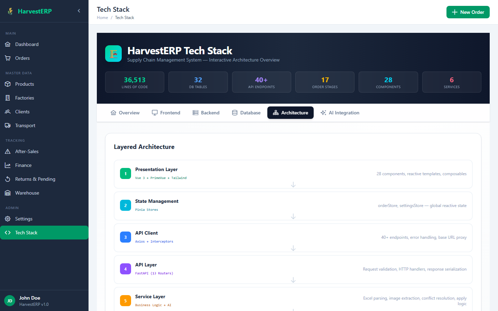

**Purpose:** Interactive layered architecture diagram.
- 7 layers from Presentation (Vue 3) down to Database (SQLite)
- Hover any layer to highlight it and see details
- Design patterns: Snapshot Pattern, Variant System, Soft Delete

**Route:** `/tech-stack` (Architecture tab)

---

### 18 — AI Integration
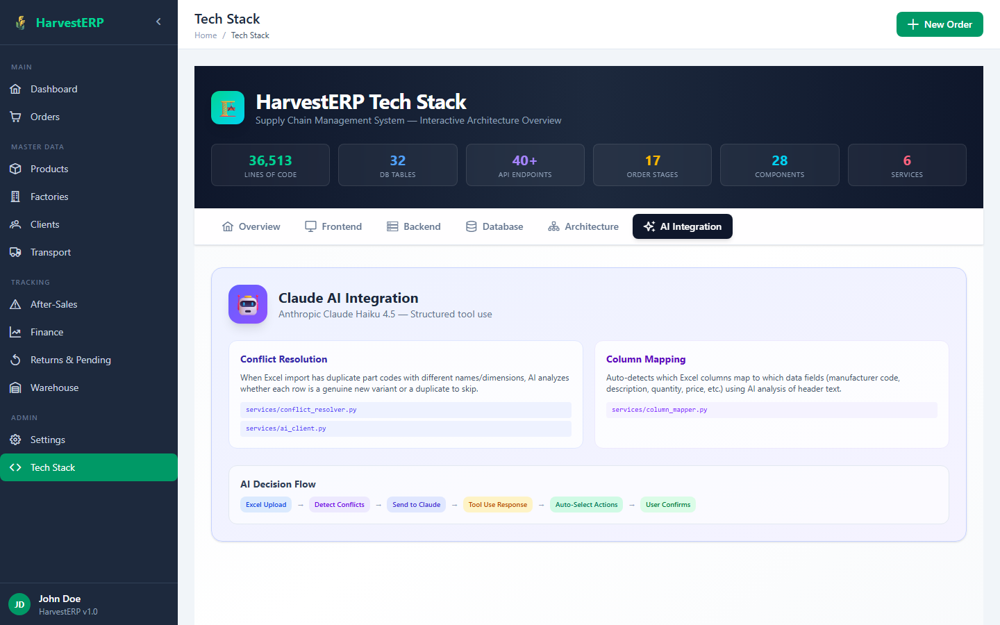

**Purpose:** Claude AI integration documentation.
- **Conflict Resolution** — AI analyzes duplicate part codes during Excel import
- **Column Mapping** — AI auto-detects Excel column purposes
- **Decision Flow** — Visual pipeline: Upload -> Detect -> AI Analyze -> Auto-Select -> User Confirms

**Route:** `/tech-stack` (AI Integration tab)

---

## Summary

| # | Screenshot | Page | Key Features |
|---|-----------|------|-------------|
| 01 | Dashboard | `/` | Metrics, shipments, activity |
| 02 | Orders | `/orders` | Order list, 17-stage workflow |
| 03 | Products | `/products` | Catalog, variants, images |
| 04 | Excel Import | `/products/upload-excel` | AI mapping, conflict resolution |
| 05 | Factories | `/factories` | Supplier management |
| 06 | Clients | `/clients` | Customer management |
| 07 | Transport | `/transport` | Shipping logistics |
| 08 | After-Sales | `/after-sales` | Post-delivery tracking |
| 09 | Finance | `/finance` | Payments, invoices, duties |
| 10 | Returns | `/returns-pending` | Returns & pending items |
| 11 | Warehouse | `/warehouse` | Stock levels |
| 12 | Settings | `/settings` | System configuration |
| 13-18 | Tech Stack | `/tech-stack` | Interactive architecture docs |
